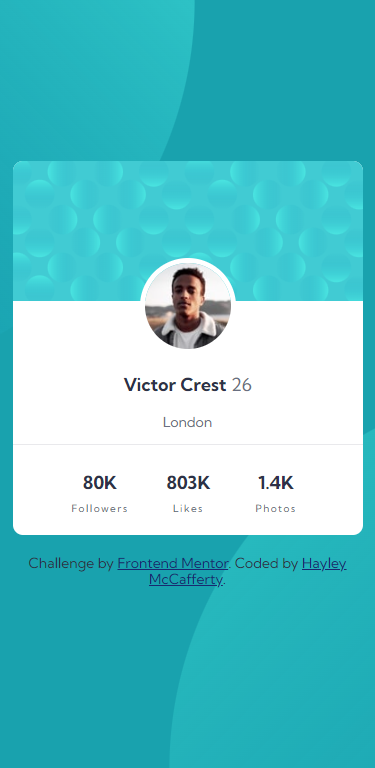

# Profile Card Component

Challenge from [Frontend Mentor](https://www.frontendmentor.io/)

## Usage

The purpose of this project was to practice HTML and CSS skills with a design
from Frontend Mentor challenge

## Challenge Description

"This is a perfect challenge to test your layout skills. The card layout doesn't
shift, so it's also great for those that haven't dived into responsive websites
yet!"

## Tech Stack

**Client:** HTML, CSS

## Authors

- [@haylzrandom - GitHub](https://www.github.com/haylzrandom)
- [@haylzrandom - Frontend Mentor](https://www.frontendmentor.io/profile/HaylzRandom)

## Acknowledgements

- [Profile Card Component](https://www.frontendmentor.io/challenges/profile-card-component-cfArpWshJ)

## Related

Here are some related projects

- [Order Summary Component](https://github.com/HaylzRandom/order-summary-component)
- [QR Code Component](https://github.com/HaylzRandom/qr-code-component)
- [NFT Preview Card Component](https://github.com/HaylzRandom/nft-preview-card-component)
- [Stats Preview Component](https://github.com/HaylzRandom/stats-preview-card-component)

## Screenshots

Finished Component

